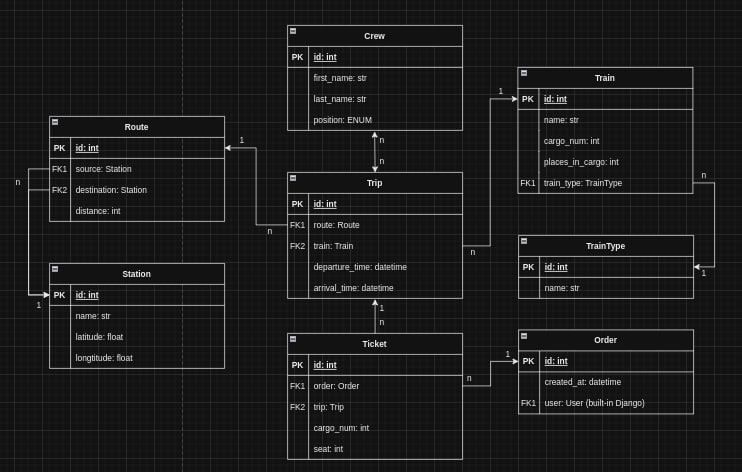

# Train Station API
The Train Station API offers developers access to train-related information and functionalities, 
allowing integration of train schedules, routes, seat availability, and booking features.
## Installation using GitHub

Install PostgresSQL and create DB

```
git clone https://github.com/MaxymChyncha/train-station-api
cd train-station-api
python -m venv venv
venv\Scripts\activate  # for MacOS/Linux use: source vevn/bin/activate
pip install -r requirements.txt
```
Don't forget to fill your ```.env``` file according to ```.env.sample```
```shell
python manage.py migrate
python manage.py loaddata train_station_db_data.json
python manage.py runserver
```


## Run with Docker
Docker should be installed and you need to be in directory with ```docker-compose.yaml``` file

```
docker-compose build ...
docker-compose up ...
```

### Features

>* JWT Authentication
>* Admin panel (/admin/)
>* Documentation (located at api/schema/swagger-ui/)
>* Managing Orders and Tickets
>* Creating Routes with Stations
>* Creating Trips, Crews, Trains, Train Types
>* Filtering Routes and Trips using different parameters 
>* Cover all custom logic with tests

### Getting access
You can use the following credentials:

* Email: `admin@admin.com`
* Password: `1qazcde3`

Or register a new user using the ```/api/user/register/``` endpoint.
Obtain an authentication(access) token by sending a POST request to the ```/api/user/token/``` endpoint with your email 
and password.
Use the obtained token in the authorization header for accessing protected endpoints 
(```Authoriazation: Bearer <Your access token>```).
Be free to explore various endpoints for different functionalities provided by the API.

## Database Structure


